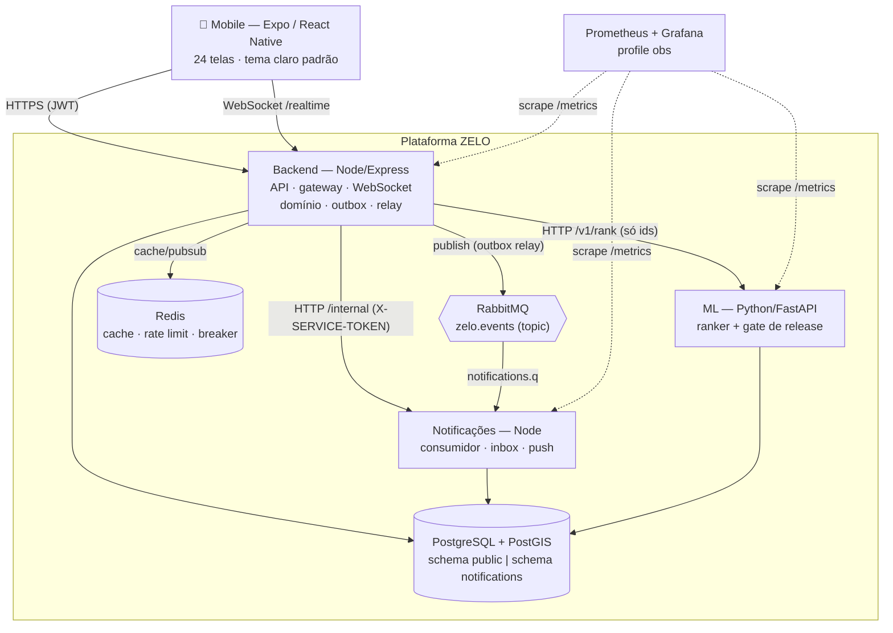
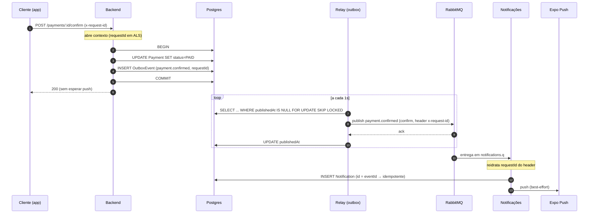
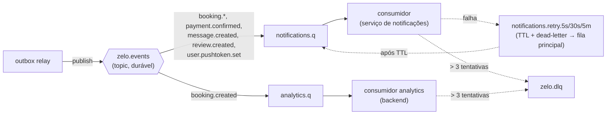

# Arquitetura do ZELO

De monolito síncrono a plataforma distribuída, com Redis (cache/rate limit/breaker),
RabbitMQ (barramento de eventos com outbox transacional), um microserviço extraído
(notificações, schema-per-service) e observabilidade (Prometheus + Grafana). Cada peça de
infra entrou puxada por um requisito, não como enfeite.

Ver também: [ADRs](adr/README.md) · [barramento de eventos](EVENTS.md) ·
[cache e resiliência](../README.md#cache-e-resiliência-redis).

## Contexto (C4 nível 1–2)

Degradação como propriedade de projeto: **Redis, RabbitMQ, ML e o serviço de notificações
são todos opcionais**. Cada um fora do ar vira uma degradação nomeada (cache passthrough,
outbox represado, ranking por nota, inbox vazio), nunca uma queda.

## Sequência — `payment.confirmed` ponta a ponta

O caminho mais crítico (é onde perder um evento custaria dinheiro no ledger da Onda 7), e o
que mostra outbox + correlation id atravessando o broker.

O `x-request-id` nasce na request HTTP, é gravado no outbox, viaja como header AMQP e é
reidratado no serviço — um rastro único do toque no app até o push entregue.

## Topologia AMQP

Retry **por consumidor** (não global): um `booking.created` que falha em `notifications`
não reprocessa em `analytics`, que já teve sucesso. Detalhes e o *caveat* de entrega em
[EVENTS.md](EVENTS.md).

## Observabilidade

`prom-client` no backend e no serviço de notificações, `prometheus-fastapi-instrumentator`
no ML — todos expõem `/metrics`. Além das métricas de HTTP, as de **negócio**:
`events_published_total`, `events_consumed_total`, `event_processing_duration_seconds`,
`outbox_pending`, `ml_circuit_state`, `cache_hits_total`, `notifications_persisted_total`,
`push_sent_total`. `docker compose --profile obs up` sobe Prometheus (`:9090`) e Grafana
(`:3000`) com um painel provisionado (`docker/observability/`).
